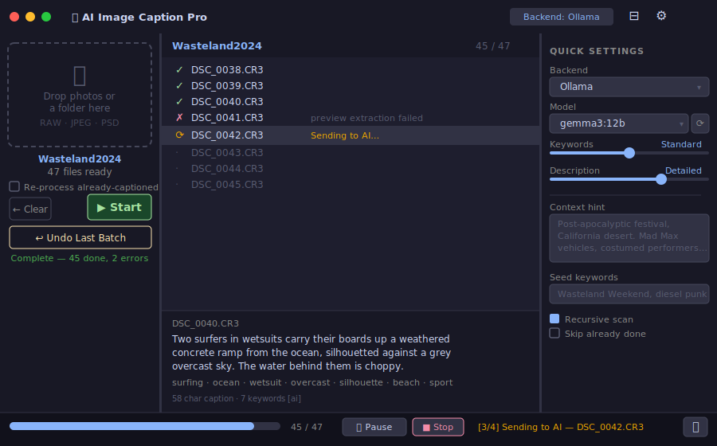

# AI Image Caption Pro

**Drag a folder of photos. Get IPTC captions and keywords written directly into every file.**



Drop a folder of RAW, JPEG, or PSD images onto the window. The app sends each photo to an AI vision model, generates a caption and keyword set, and writes them back as IPTC/XMP metadata — the fields Lightroom, Capture One, and Photo Mechanic read natively.

---

## Backends

| Backend | Setup |
|---|---|
| **Ollama** (local, no API key) | `brew install ollama && ollama pull gemma3:12b` |
| **Google Gemini** | API key from [aistudio.google.com](https://aistudio.google.com) |
| **Anthropic Claude** | API key from [console.anthropic.com](https://console.anthropic.com) |
| **OpenAI GPT-4o** | API key from [platform.openai.com](https://platform.openai.com) |

---

## Quick start

```bash
brew install exiftool
pip install -r requirements.txt
python main.py
```

---

## What it writes

- `IPTC:Caption-Abstract` — AI caption, appended to any existing caption
- `IPTC:Keywords` + `XMP-dc:Subject` — deduplicated, merged with existing keywords
- `XMP-lr:HierarchicalSubject` — for Lightroom keyword hierarchy
- `XMP:Description`, `XMP:Creator`, `XMP:Rights` — mirrored from identity settings
- `XMP-iptcExt:AltTextAccessibility` — for CMS / screen readers
- XMP sidecar `.xmp` alongside RAW files — Photo Mechanic reads instantly, no Cmd+R needed

---

## Supported formats

CR3 · CR2 · ARW · NEF · NRW · DNG · RAF · ORF · RW2 · PSD · PSB · JPG · JPEG

RAW and PSD files have their embedded preview extracted for the AI — original pixel data is never touched.

---

## AI brief

Drop a `context.md` into any shoot folder and the app includes it in every caption prompt for that folder. Set a global brief in Settings for your overall photography style and vocabulary.

---

## Requirements

- macOS or Linux
- Python 3.11+
- ExifTool (`brew install exiftool` / `apt install libimage-exiftool-perl`)
- Ollama (optional — only for local AI backend)
